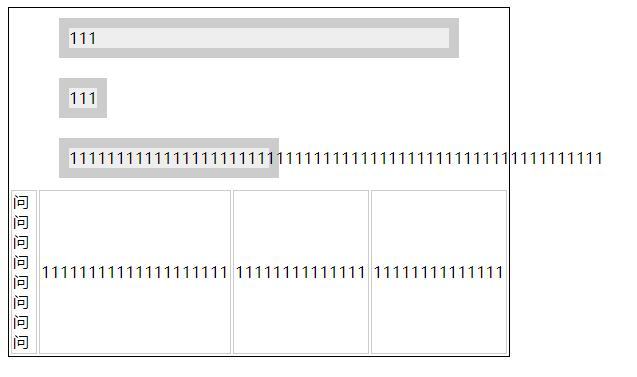
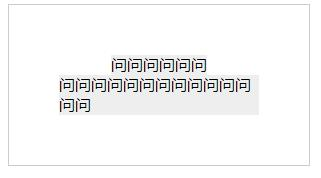

### 《css世界》1-3章

### 未定义行为
* 在规范描述以外的场景

### 流
* 自上而下（块级元素），从左到右（内联元素）

### 盒模型
* 块级元素：一个水平流上只能单独显示一个元素，多个块级元素则换行显示
* 内联元素：是可以和文字在一行显示
    * 外在盒子：控制元素是否可以和文字在一行显示
    * 内在盒子：控制元素是否可以有宽高
        * content box：默认width作用在这
        * padding box
        * border box
        * box-sizing（ie8需要加前缀）：改变width的作用细节
  
#### width的默认值
* 充分利用可用空间。块级元素width默认是铺满父元素，但并不是100%（margin/border/padding
                                      和 content 内容区域自动分配水平空间的机制。）
* 收缩与包裹。如浮动、绝对定位、inline-block 元素或 table 元素，需要内部内容撑开
* 超出容器限制。除非有明确的 width 相关设置，否则上面 3 种情况尺寸都不会主动超过父级容器宽度的，
    但是存在一些特殊情况。例如，内容很长的连续的英文和数字，或者内联元素被设置了 white-space:nowrap，
* 收缩到最小。这个最容易出现在 table-layout 为 auto 的表格中

[上图demo地址](width.html)
* 利用width自适应和margin叠加制作的自适应导航[demo地址](width2.html)
##### 外部尺寸
* 正常流宽度：铺满容器
* 格式化宽度：（父级宽度-left-right）格式化宽度仅出现在“绝对定位模型”中，也就是出现在 position属性值为 absolute 或 
    fixed 的元素中。在默认情况下，绝对定位元素的宽度表现是“包裹性”，宽度由内部尺寸决定.对于非
    替换元素，当 left/top 或 top/bottom 对立方位的属性值同时存在的时候，元素的宽度表现为“格式
    化宽度”，其宽度大小相对于最近的具有定位特性（position 属性值不是 static）的祖先元素计算。
##### 内部尺寸
* 包裹性：是元素尺寸由内部元素决定，但永远小于“包含块”容器的尺寸（一行居中，两行居左）

[上图demo地址](width3.html)
* 首选最小宽度(P22)
    * 东亚文字（如中文）最小宽度为每个汉字的宽度x
    * 西方文字最小宽度由特定的连续的英文字符单元决定
    * 类似图片这样的替换元素的最小宽度就是该元素内容本身的宽度。
* 最大宽度：如果内部没有块级元素或者块级元素没有设定宽度值，则“最大宽度”实际上是最大的连
       续内联盒子的宽度，（焦点图滚动可以用）
#### 设置width值
* 流动性丢失。
* 与现实世界表现不一致的困扰（padding 或 border 会让元素宽度变大）
    
* 焦点元素：像\<a\>、\<button\>这样的元素，当我们使用键盘进行 Tab 键切换的时候，是可以被 focus 的，
    表现为虚框或者外发光，这类元素称为“焦点元素”；非焦点元素指没有设置 tabindex 属性的\<div>、\<span>
    等普通元素。在 IE6/IE7 浏览器下，非焦点元素对:active 置若罔闻。


### height
* 定位元素的百分比计算基于padding box计算的（不是border box）
* 非定位元素的百分比计算基于content box计算的
* 如何让元素支持 height:100%效果
    * 设定显式的高度值`html, body {height: 100%; } `
    * 使用绝对定位。`div{height: 100%; position: absolute; }`绝对定位元素的百分比计算和非绝对定位
        元素的百分比计算是有区别的，区别在于绝对定位的宽高百分比计算是相对于 padding box 的，也就是
        说会把 padding 大小值计算在内，但是，非绝对定位元素则是相对于 content box 计算的。

### max-width、max-height、min-width、min-height
* 适合自适应或流体布局（与百分比配合）
* 避免图片在移动端展示过大
```
img{
    max-width: 100%;
    height: auto!important; 
}   
```
* min-width/min-height 的初始值是 auto，max-width/max-height的初始值是none
* 超越important(例如max-height会覆盖height，无关权重，)
* 超越最大（最大最小同时作用，较大的值会覆盖较小的值）
```
.container {
     min-width: 1400px;
     max-width: 1200px;
 } 

```
* 没有固定高度的情况时使用max-height代替height制作动画效果
       
### 内联元素
* “外在盒子”是内联盒子的元素。如inline-block、inline-table、inline等
* 可以和文字在一行显示
* 幽灵空白节点：存在于每个“行框盒子”前面，同时具有该元素的字体和行高属性的 0 宽度的内联盒
    （空白的行内块元素会撑开父级，父级被撑开的高度是父级的行高）


#### 总结小技巧
* 伪元素清除浮动
* 自适应导航（width流动性）
* 一行居中，两行居左（包裹性）
* 凹凸（首选最小宽度）
* 轮播图（最大宽度）
* 高度100%
* 避免图片在移动端展示过大